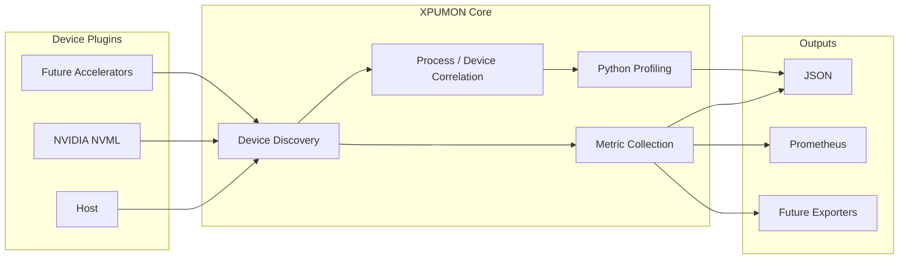

# XPUMON

XPUMON is a vendor-neutral monitoring, profiling, and observability framework for heterogeneous AI infrastructure.

It provides a common plugin interface for discovering accelerator devices, collecting telemetry, profiling Python workloads, and exporting metrics to observability systems such as Prometheus.

---

## Dashboard Concept

<p align="center">
  
</p>

<p align="center">
  <sub>
    Concept dashboard generated by generative AI to illustrate a possible
    Grafana-based interface for correlating accelerator telemetry with Python profiling data.
  </sub>
</p>

> The dashboard above is a conceptual visualization and is not yet included as an implemented Grafana dashboard.

---

## Features

| Area | Capabilities |
|---|---|
| **Monitoring** | Host telemetry, NVIDIA GPU telemetry through NVML, multi-device discovery |
| **Profiling** | Python process discovery, `py-spy dump`, `py-spy record`, process exclusion |
| **Correlation** | GPU-backed Python process discovery and device metadata association |
| **Export** | JSON metrics, JSON profiles, Prometheus `/metrics` endpoint |
| **Extensibility** | Vendor-neutral device, capability, metric, and plugin interfaces |

---

## Current Output

<table>
  <tr>
    <td align="center" width="50%">
      <strong>py-spy Record Profile</strong><br><br>
      <br><br>
      <sub>
        Sampling profile collected through <code>py-spy record</code>
        and emitted as a raw profile record.
      </sub>
    </td>
    <td align="center" width="50%">
      <strong>py-spy Dump Profile</strong><br><br>
      <br><br>
      <sub>
        Python thread and frame data collected through
        <code>py-spy dump</code> and emitted as structured JSON.
      </sub>
    </td>
  </tr>
</table>

<br>

<table>
  <tr>
    <td align="center" width="50%">
      <strong>Metrics JSON Output</strong><br><br>
      <br><br>
      <sub>
        Unified host and accelerator metrics represented through
        the common XPUMON metric model.
      </sub>
    </td>
    <td align="center" width="50%">
      <strong>Prometheus Exporter</strong><br><br>
      <br><br>
      <sub>
        Device metrics exposed in Prometheus exposition format
        through the <code>/metrics</code> endpoint.
      </sub>
    </td>
  </tr>
</table>

---

## Architecture



Every telemetry source implements the same plugin interface.

```go
type Plugin interface {
    Name() string
    Discover(ctx context.Context) ([]Device, error)
    Capabilities(ctx context.Context, deviceID string) ([]Capability, error)
    Collect(ctx context.Context, deviceID string) ([]Metric, error)
}
```

Vendor-specific implementations remain isolated behind plugins, while the core operates on shared device, capability, and metric models.

---

## Repository Structure

```text
.
├── cmd/
│   └── xpumon/
├── configs/
│   ├── pyspy-dump.yaml
│   └── pyspy-record.yaml
├── docs/
│   ├── images/
│   ├── 00-overview.md
│   ├── 01-plugin-api.md
│   └── 02-profiling.md
├── exporters/
│   └── prometheus/
├── pkg/
├── plugins/
│   ├── host/
│   └── nvidia/
└── README.md
```

---

## Quick Start

### Build

```bash
go build -o xpumon ./cmd/xpumon
```

### Collect Metrics

Collect one telemetry snapshot as JSON:

```bash
./xpumon
```

### Run Prometheus Exporter

```bash
./xpumon serve
```

The default endpoint is:

```text
http://localhost:9108/metrics
```

Verify the exported metrics:

```bash
curl http://localhost:9108/metrics
```

### Run Python Stack Snapshot

Use `dump` mode to collect the current Python thread and call-stack state:

```bash
./xpumon profile --config ./configs/pyspy-dump.yaml
```

### Run Sampling Profiler

Use `record` mode to collect samples over a configured duration:

```bash
./xpumon profile --config ./configs/pyspy-record.yaml
```

### Run Tests

```bash
go test ./...
```

---

## Metrics

XPUMON exposes normalized host and accelerator telemetry.

Example Prometheus metrics:

```text
xpumon_device_gpu_utilization_ratio
xpumon_device_memory_total_bytes
xpumon_device_memory_used_bytes
xpumon_device_memory_free_bytes
xpumon_device_memory_available_bytes
xpumon_device_memory_utilization_ratio
xpumon_device_temperature_celsius
xpumon_device_power_watts
```

Collector health metrics:

```text
xpumon_up
xpumon_scrape_duration_seconds
xpumon_scrape_errors
xpumon_scrape_metrics
```

Device-specific information is represented through labels such as `device_id`.

```text
xpumon_device_gpu_utilization_ratio{
  device_id="GPU-8994d77e-21c7-99de-5b47-d8180c8d8623"
} 0.96
```

---

## Profiling

XPUMON discovers Python processes and correlates them with accelerator usage before profiling them through `py-spy`.

A profile record includes:

| Field | Description |
|---|---|
| `profiler` | Profiling implementation, such as `py-spy` |
| `mode` | Profiling mode: `dump` or `record` |
| `target.pid` | Profiled process ID |
| `target.command` | Process command |
| `target.hostname` | Hostname on which the process is running |
| `target.devices` | Accelerator devices associated with the process |
| `started_at` | Profiling start timestamp |
| `ended_at` | Profiling completion timestamp |
| `format` | Output format |
| `data` | Raw or structured profiling result |

The current NVIDIA implementation correlates Python processes with GPU devices using NVML process information.

---

## Configuration

XPUMON uses YAML configuration for process discovery and profiling.

Example configurations:

- [`configs/pyspy-dump.yaml`](configs/pyspy-dump.yaml)
- [`configs/pyspy-record.yaml`](configs/pyspy-record.yaml)

Configuration supports:

| Category | Options |
|---|---|
| Process discovery | Linux `/proc`-based Python process discovery |
| Process filtering | PID, user, command, and executable exclusion |
| Profiler | `py-spy` binary and execution options |
| Mode | `dump` and `record` |
| Sampling | Duration and sampling rate |
| Stack collection | Optional native stack collection |
| Output | Raw or structured profiling data |

---

## Roadmap

### Implemented

- [x] Vendor-neutral plugin interface
- [x] Shared device, capability, and metric models
- [x] Host telemetry plugin
- [x] NVIDIA NVML plugin
- [x] Multi-device discovery
- [x] Host and GPU telemetry collection
- [x] JSON metrics output
- [x] Python process discovery
- [x] Configurable process exclusion
- [x] GPU-backed Python process correlation
- [x] `py-spy dump` integration
- [x] `py-spy record` integration
- [x] JSON profiling output
- [x] Prometheus metrics exporter
- [x] YAML-based profiling configuration

### Planned

- [ ] Grafana dashboard templates
- [ ] Profiling timeline visualization
- [ ] Flame graph visualization
- [ ] OpenTelemetry exporter
- [ ] Container-aware process metadata
- [ ] Kubernetes integration
- [ ] AMD accelerator plugin
- [ ] Intel accelerator plugin
- [ ] Additional heterogeneous accelerator plugins

---

## Documentation

- [Project Overview](docs/00-overview.md)
- [Plugin API](docs/01-plugin-api.md)
- [Profiling](docs/02-profiling.md)

Additional documentation will be added as the project evolves.

---

## License

Licensed under the Apache License 2.0. See the [LICENSE](LICENSE) file for details.