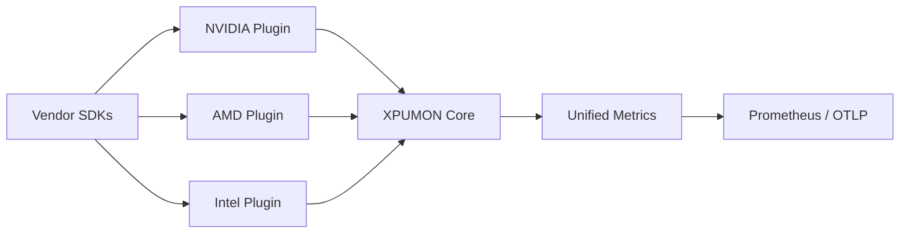

## Project Goal

XPUMON is a vendor-neutral, plugin-based monitoring framework for heterogeneous AI accelerators.



It provides a common abstraction layer for collecting and normalizing telemetry from GPUs, XPUs, NPUs, DPUs, FPGAs, and future AI ASICs without coupling the core framework to a specific hardware vendor.

XPUMON does not replace vendor management libraries such as NVIDIA NVML or AMD SMI. Instead, vendor-specific SDKs are isolated behind plugins that expose devices, capabilities, and metrics through a unified interface.


## Project Status

XPUMON is currently in the early implementation phase.

* [x] Define the vendor-neutral plugin interface
* [x] Define shared device, capability, and metric models
* [x] Implement a mock plugin for core testing
* [x] Add the initial NVIDIA NVML plugin structure
* [x] Validate telemetry collection on NVIDIA hardware
* [ ] Complete metric normalization
* [ ] Add a Prometheus-compatible export path
* [ ] Add additional vendor plugins
* [ ] Add Kubernetes deployment support

## Documentation

```text
docs/
├── 00-overview.md      # Project vision, goals, non-goals, design principles and high-level vendor-neutral architecture
└── 01-plugin-api.md    # Plugin interface, plugin lifecycle, capabilities, collection workflow, and shared data models
```
* [00-overview.md](docs/00-overview.md)
* [01-plugin-api.md](docs/01-plugin-api.md)

## License

XPUMON is licensed under the [Apache License 2.0](LICENSE).
