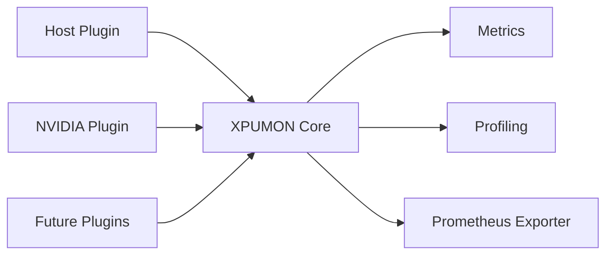

# XPUMON

XPUMON is a vendor-neutral monitoring, profiling, and observability framework for heterogeneous AI infrastructure.

It provides a common plugin interface for discovering accelerator devices, collecting telemetry, profiling Python workloads, and exporting metrics for modern observability platforms such as Prometheus.

---

## Features

### Monitoring

- Vendor-neutral plugin architecture
- Host telemetry collection
- NVIDIA GPU telemetry through NVML
- Multi-device discovery
- Unified device, capability, and metric models
- Prometheus metrics exporter

### Profiling

- Python process discovery
- Configurable process discovery and exclusion
- GPU-backed Python process correlation
- `py-spy dump` integration
- `py-spy record` integration
- YAML-based profiling configuration

### Observability

- JSON metrics output
- JSON profiling output
- Prometheus `/metrics` endpoint
- Correlation between device telemetry and Python profiling

---

## Architecture



Every telemetry source implements the same plugin interface.

```go
type Plugin interface {
    Name() string
    Discover(ctx context.Context) ([]Device, error)
    Capabilities(ctx context.Context, deviceID string) ([]Capability, error)
    Collect(ctx context.Context, deviceID string) ([]Metric, error)
}
```

---

## Demo

### py-spy Record Profile


### py-spy Dump Profile


### Metrics JSON Output


### Prometheus Metrics Exporter


### XPUMON AI Observability Dashboard

> **Note**
>
> This dashboard is a concept visualization generated by Generative AI. It illustrates a possible Grafana-based observability interface for XPUMON.


---

## Repository Structure

```text
.
├── cmd/
├── configs/
├── docs/
│   ├── images/
│   ├── 00-overview.md
│   ├── 01-plugin-api.md
│   └── 02-profiling.md
├── pkg/
├── plugins/
│   ├── host/
│   └── nvidia/
└── README.md
```

---

## Quick Start

Build XPUMON:

```bash
go build -o xpumon ./cmd/xpumon
```

Collect metrics as JSON:

```bash
./xpumon
```

Run Prometheus exporter:

```bash
./xpumon serve
```

Verify Prometheus metrics:

```bash
curl http://localhost:9108/metrics
```

Run Python stack snapshot (`dump` mode):

```bash
./xpumon profile --config ./configs/pyspy-dump.yaml
```

Run sampling profiler (`record` mode):

```bash
./xpumon profile --config ./configs/pyspy-record.yaml
```

Run tests:

```bash
go test ./...
```

---

## Configuration

XPUMON uses YAML configuration for process discovery and profiling.

Example configurations:

- [`configs/pyspy-dump.yaml`](configs/pyspy-dump.yaml)
- [`configs/pyspy-record.yaml`](configs/pyspy-record.yaml)

Configuration supports:

- Process discovery (`/proc`)
- Process exclusion by PID, user, command, or executable
- `py-spy` binary configuration
- `dump` and `record` profiling modes
- Native stack collection

---

## Roadmap

### Implemented

- Vendor-neutral plugin interface
- Host plugin
- NVIDIA NVML plugin
- Multi-device discovery
- Host and GPU telemetry collection
- JSON metrics output
- JSON profiling output
- GPU-backed Python process correlation
- `py-spy dump` integration
- `py-spy record` integration
- Prometheus metrics exporter
- YAML-based configuration

### Planned

- OpenTelemetry exporter
- Grafana dashboard templates
- Flame graph visualization
- AMD plugin
- Intel plugin
- TPU plugin
- FPGA plugin
- Kubernetes integration

---

## Documentation

- [Project Overview](docs/00-overview.md)
- [Plugin API](docs/01-plugin-api.md)
- [Profiling](docs/02-profiling.md)

Additional documentation will continue to expand alongside the project.

---

## License

Licensed under the Apache License 2.0. See the [LICENSE](LICENSE) file for details.