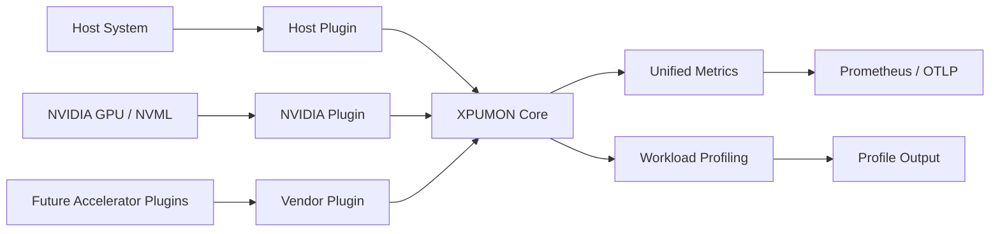
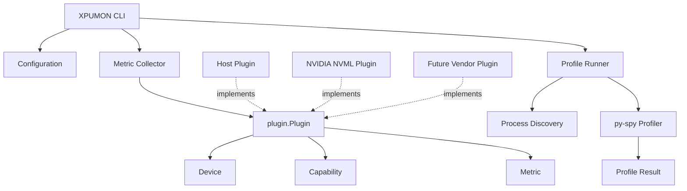
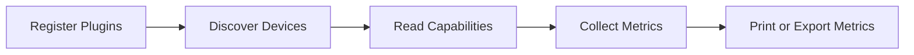

# XPUMON

XPUMON is a vendor-neutral, plugin-based monitoring and profiling framework for heterogeneous AI infrastructure.

It provides a common abstraction layer for discovering devices, collecting host and accelerator telemetry, and profiling Python workloads without coupling the core framework to a specific hardware vendor.



XPUMON does not replace vendor management libraries such as NVIDIA NVML or AMD SMI.

Instead, vendor-specific SDKs are isolated behind plugins that expose devices, capabilities, and metrics through a common interface.

XPUMON also integrates with `py-spy` to inspect the Python stack of running workloads. This allows accelerator telemetry to be analyzed together with information about the process and Python code path responsible for the workload.

---

## Features

### Device and Metric Collection

- Vendor-neutral plugin interface
- Shared device, capability, and metric models
- Host device discovery
- Host CPU and memory telemetry
- NVIDIA GPU discovery through NVML
- Multi-GPU discovery and collection
- NVIDIA utilization, memory, temperature, power, and related telemetry
- Extensible architecture for additional accelerator vendors

### Workload Profiling

- Python process discovery
- `py-spy dump` snapshot profiling
- `py-spy record` sampling profiling
- YAML-based profiling configuration
- Optional native stack collection
- Process, device, container, job, and command metadata attachment
- Text-oriented profile output suitable for CLI inspection and log collection

---

## Architecture

XPUMON separates the vendor-neutral core from hardware-specific implementations.



Each telemetry source is implemented behind a common interface.

```go
type Plugin interface {
    Name() string
    Discover(ctx context.Context) ([]Device, error)
    Capabilities(ctx context.Context, deviceID string) ([]Capability, error)
    Collect(ctx context.Context, deviceID string) ([]Metric, error)
}
```

The core collector does not need to directly understand NVML or another vendor SDK. It only depends on the shared plugin interface and data models.

---

## Requirements

### Common Requirements

- Linux
- Go 1.24 or later

### NVIDIA Monitoring

- NVIDIA GPU
- NVIDIA driver
- NVML library accessible from the system

NVML is normally installed as part of the NVIDIA driver.

### Python Profiling

- Python workload
- [`py-spy`](https://github.com/benfred/py-spy)
- Permission to inspect the target process

On Linux, profiling another process may require root privileges, an appropriate `ptrace_scope` setting, or the `SYS_PTRACE` capability.

---

## Build

Clone the repository and build the CLI.

```bash
git clone https://github.com/hdimmfh/xpu-monitor-agent.git
cd xpu-monitor-agent

go build -o xpumon ./cmd/xpumon
```

Run all tests:

```bash
go test ./...
```

---

## Metric Collection

Run XPUMON without a subcommand to discover devices and collect available metrics.

```bash
./xpumon
```

During development, it can also be run directly:

```bash
go run ./cmd/xpumon
```

The collector calls each registered plugin and performs the following workflow:



A plugin may return multiple devices. For example, an NVIDIA plugin discovers every GPU visible through NVML and collects metrics for each returned device.

---

## Python Profiling

XPUMON supports two `py-spy` modes:

- `dump`: captures an instantaneous Python stack snapshot
- `record`: samples a Python process over a configured duration

### Dump Mode

Use the dump configuration:

```bash
./xpumon profile --config ./configs/pyspy-dump.yaml
```

Example configuration:

```yaml
profiling:
  enabled: true

  pyspy:
    binary: py-spy
    mode: dump
    native: false
```

Example output:

```text
profile=py-spy pid=206450 format=text started_at=2026-07-15T09:00:08Z ended_at=2026-07-15T09:00:08Z hostname="worker-01" command="python torch_test.py"
profile_data_begin
Process 206450: python torch_test.py
Python v3.12.3

Thread 206450 (active): "MainThread"
    synchronize (torch/cuda/__init__.py:1219)
    <module> (torch_test.py:28)
profile_data_end
```

`dump` mode is suitable for:

- Periodic stack snapshots
- CLI inspection
- Log-based process tracing
- Identifying synchronization or blocking points
- Inspecting multiple Python processes with a low collection duration

To repeatedly capture snapshots:

```bash
watch -n 1 './xpumon profile --config ./configs/pyspy-dump.yaml'
```

### Record Mode

Use the record configuration:

```bash
./xpumon profile --config ./configs/pyspy-record.yaml
```

Example configuration:

```yaml
profiling:
  enabled: true

  pyspy:
    binary: py-spy
    mode: record
    duration: 10s
    sample_rate: 20
    format: raw
    native: false
```

`record` mode is suitable for:

- Sampling a workload over time
- Finding frequently executing Python functions
- Comparing accumulated stack activity
- Generating data for subsequent profile analysis

---

## Configuration

The profiling configuration is stored under the `profiling` key.

```yaml
profiling:
  enabled: true

  pyspy:
    binary: py-spy
    mode: dump
    native: false
```

### Mode-Specific Fields

| Field | Dump | Record | Description |
|---|---:|---:|---|
| `profiling.enabled` | Required | Required | Enables profiling |
| `pyspy.binary` | Required | Required | Path or command name for `py-spy` |
| `pyspy.mode` | Required | Required | `dump` or `record` |
| `pyspy.duration` | Not used | Required | Sampling duration |
| `pyspy.sample_rate` | Not used | Required | Samples per second |
| `pyspy.format` | Text output | Required | Record output format |
| `pyspy.native` | Optional | Optional | Includes native stack frames |

Fields used only by `record` mode should not be required when `mode` is set to `dump`.

See [Configuration Reference](docs/03-configuration.md) for details.

---

## Profiling Scope and Limitations

`py-spy` inspects Python and optionally native CPU-side stacks.

It does not directly inspect GPU kernel execution.

For asynchronous CUDA workloads, the Python stack may show:

- CUDA API calls
- Tensor operations
- Synchronization calls
- Data loading code
- Framework control flow

A long-running GPU kernel may continue executing while the Python thread is idle, waiting, or submitting later work. Therefore, py-spy output should be interpreted together with accelerator utilization metrics or a GPU profiler such as NVIDIA Nsight Systems.

A stack repeatedly showing `torch.cuda.synchronize()` means that the sampled Python thread was waiting at that synchronization point. It does not mean that the synchronization call itself performed the GPU computation.

---

## Project Structure

```text
.
├── cmd/
│   └── xpumon/
│       └── main.go
├── configs/
│   ├── pyspy-dump.yaml
│   └── pyspy-record.yaml
├── docs/
│   ├── 00-overview.md
│   ├── 01-plugin-api.md
│   ├── 02-profiling.md
│   └── 03-configuration.md
├── pkg/
│   ├── collector/
│   ├── mock/
│   ├── plugin/
│   └── profiler/
├── plugins/
│   ├── host/
│   └── nvidia/
├── go.mod
├── go.sum
└── README.md
```

The exact package structure may evolve while the project is under active development.

---

## Project Status

XPUMON is currently in the implementation and hardware-validation phase.

### Implemented

- [x] Vendor-neutral plugin interface
- [x] Shared device, capability, and metric models
- [x] Mock plugin for core testing
- [x] Host telemetry plugin
- [x] NVIDIA NVML plugin
- [x] Multi-device discovery
- [x] NVIDIA hardware telemetry collection
- [x] Python process discovery
- [x] `py-spy dump` mode
- [x] `py-spy record` mode
- [x] YAML-based profiler configuration
- [x] CLI profile execution

### In Progress

- [ ] Stable metric naming and normalization
- [ ] Process-to-GPU attribution
- [ ] Container and Kubernetes workload metadata discovery
- [ ] Prometheus-compatible exporter
- [ ] OpenTelemetry exporter
- [ ] Kubernetes deployment manifests
- [ ] Additional accelerator plugins
- [ ] Stable public configuration schema
- [ ] Continuous profiling and profile aggregation

---

## Documentation

```text
docs/
├── 00-overview.md
├── 01-plugin-api.md
├── 02-profiling.md
└── 03-configuration.md
```

- [Project Overview](docs/00-overview.md)
- [Plugin API](docs/01-plugin-api.md)
- [Python Profiling](docs/02-profiling.md)
- [Configuration Reference](docs/03-configuration.md)

---

## License

XPUMON is licensed under the [Apache License 2.0](LICENSE).
