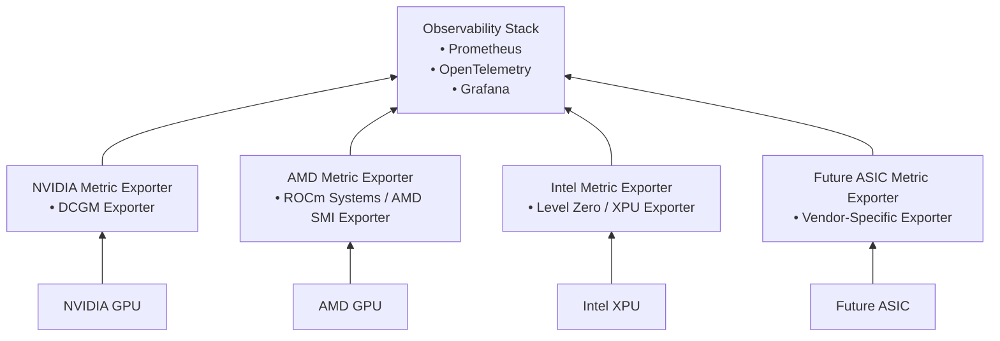
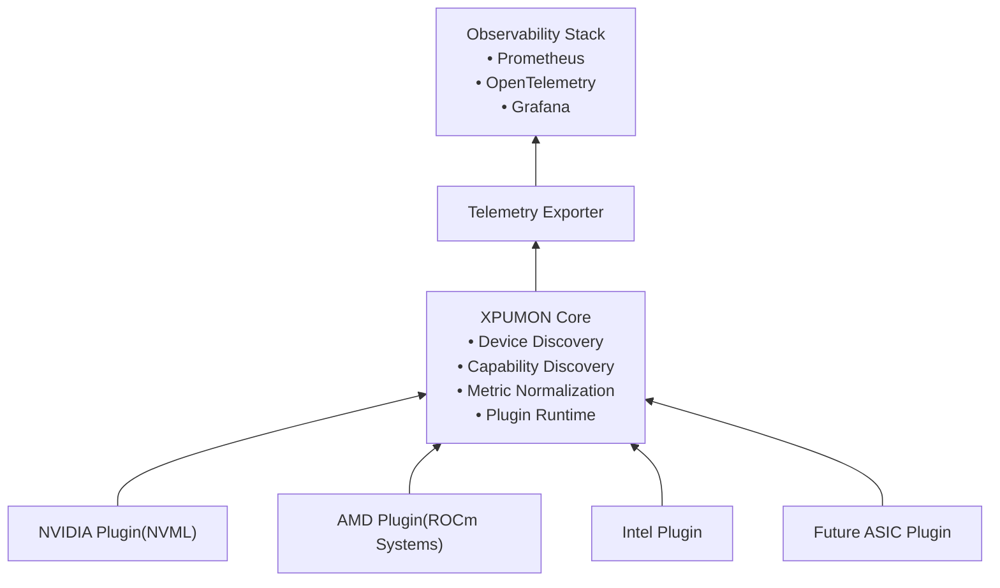

# XPUMON Overview

## Introduction

XPUMON is a vendor-neutral monitoring framework for heterogeneous AI accelerators.

Unlike existing monitoring solutions that are tightly coupled to a single hardware vendor, XPUMON provides a unified telemetry model for GPUs, XPUs, NPUs, DPUs, FPGAs, and future AI ASICs through a plugin-based architecture.

The project is inspired by NVIDIA DCGM and AMD ROCm Systems, but its objective is not to replace vendor-specific management libraries. Instead, XPUMON provides a common abstraction layer that allows heterogeneous accelerator devices to expose telemetry using a consistent interface.

---

## Vision

Modern AI infrastructure is becoming increasingly heterogeneous.

A single cluster may contain accelerators from multiple vendors, each exposing different management APIs, telemetry formats, and monitoring capabilities.

XPUMON aims to eliminate these differences by introducing a common monitoring framework that:

* Discovers accelerator devices automatically
* Normalizes telemetry into a unified metric model
* Supports multiple hardware vendors through plugins
* Integrates with existing observability platforms
* Remains extensible for future accelerator architectures

---

## Goals

### Primary Goals

* Support heterogeneous accelerator devices
* Provide a vendor-neutral monitoring interface
* Normalize hardware telemetry across vendors
* Enable easy integration with Prometheus and OpenTelemetry
* Allow third parties to develop device plugins without modifying the core framework

### Long-term Goals

* Support future AI ASICs without redesigning the core architecture
* Provide health diagnostics and event monitoring
* Offer Kubernetes-native deployment
* Become a common monitoring layer for heterogeneous AI infrastructure

---

## Non-Goals

XPUMON is **not** intended to:

* Replace vendor management libraries such as DCGM or AMD SMI
* Control accelerator hardware (clock tuning, power limits, firmware updates, etc.)
* Implement device-specific optimization features

Those responsibilities remain with vendor-specific software stacks.

---

## Design Principles

XPUMON follows several core principles.

### Vendor Neutrality

The core framework must not depend on a specific hardware vendor.

All vendor-specific functionality must be isolated within plugins.

### Capability-Based Design

Devices are identified by their capabilities rather than by vendor-specific implementations.

Examples include:

* Temperature
* Power
* Memory
* Utilization
* Health
* Fabric
* ECC

New capabilities should be extendable without changing the core architecture.

### Plugin Extensibility

Every supported accelerator is implemented as a plugin.

The core framework should not require modifications when supporting a new vendor or future ASIC.

### Standardized Metrics

Telemetry collected from different vendors should be normalized into a common metric schema.

Vendor-specific metrics may be exposed as optional extensions.

### Cloud-Native Integration

XPUMON should integrate naturally with modern observability ecosystems, including:

* Prometheus
* OpenTelemetry
* Grafana
* Datadog
* Kubernetes

---
## High-Level Architecture

### AS-IS: Vendor-Specific Monitoring

### TO-BE: XPUMON Unified Monitoring

### Comparison

| Area | AS-IS | TO-BE |
|---|---|---|
| Architecture | Vendor-specific exporters | Unified core with vendor plugins |
| Metric model | Different per vendor | Normalized common schema |
| Extensibility | New exporter required per device type | New plugin only |
| Future ASIC support | Depends on each vendor implementation | Supported through plugin interface |
| Observability integration | Repeated integration per exporter | Single exporter layer |
| Maintenance | Fragmented | Centralized core, isolated plugins |

---

## Benchmark Projects

The following projects serve as architectural references:

* NVIDIA DCGM
* AMD ROCm Systems

XPUMON adopts architectural concepts from these projects while remaining independent and vendor-neutral.

---

## Current Status

Current development phase:

- Architecture design
- Plugin interface specification
- Unified metric schema definition

Implementation will begin after the architecture reaches its first stable revision.
