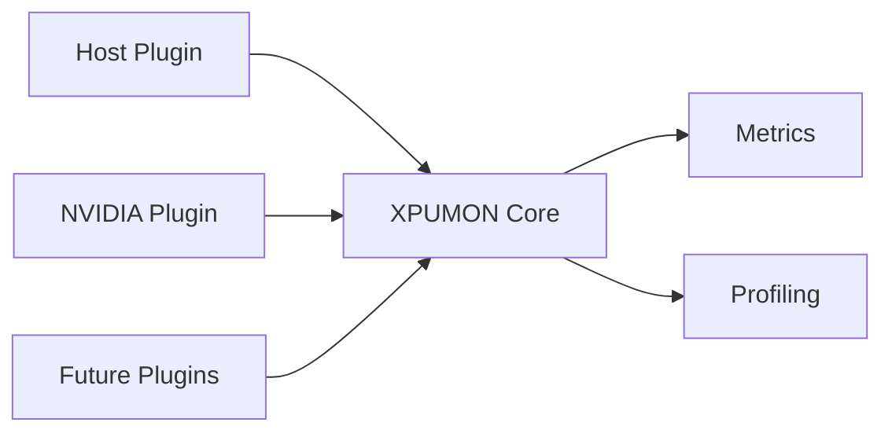

# Project Overview

## Introduction

XPUMON is a vendor-neutral monitoring and profiling framework for heterogeneous AI infrastructure.

Modern AI systems commonly combine CPUs with multiple accelerator types such as GPUs, NPUs, XPUs, and other specialized devices. Each vendor exposes different management APIs, metric definitions, and capabilities, making it difficult to build a unified monitoring solution.

XPUMON provides a common plugin interface that abstracts vendor-specific implementations while exposing a unified model for devices, capabilities, metrics, and workload profiling.

---

## Goals

XPUMON is designed to:

- Provide a vendor-neutral monitoring framework
- Support heterogeneous accelerator environments
- Discover devices dynamically
- Collect host and accelerator telemetry through a common interface
- Support workload-level profiling for Python applications
- Remain extensible through a plugin architecture
- Enable future integration with standard observability systems

---

## Architecture

XPUMON separates vendor-specific implementations from the core framework.

Every telemetry source implements the same plugin interface, allowing new hardware vendors to be supported without changing the core collection workflow.

---

## Core Components

### Core Framework

Responsible for:

- Configuration
- Device discovery
- Metric collection
- Profile execution
- Shared data models

### Plugins

Plugins encapsulate vendor-specific logic.

Current implementations:

- Host plugin
- NVIDIA NVML plugin

Future implementations may include:

- AMD
- Intel
- Additional accelerator vendors

### Profiler

XPUMON integrates with `py-spy` to profile Python workloads.

Supported modes include:

- `dump` for stack snapshots
- `record` for sampling profiles

---

## Data Model

The framework uses common data models shared across all plugins.

### Device

Represents a discoverable hardware or host resource.

### Capability

Describes telemetry supported by a device.

Examples include:

- Memory
- Power
- Temperature
- Utilization

### Metric

Represents a timestamped measurement collected from a device.

---

## Design Principles

### Vendor Neutrality

Vendor SDKs remain isolated inside plugin implementations.

The core framework depends only on shared interfaces and data models.

### Plugin-Based Architecture

Each telemetry source is implemented as a plugin.

This allows new hardware vendors to be added without modifying the collector itself.

### Capability-Based Collection

Plugins advertise supported capabilities before metrics are collected, allowing devices with different feature sets to coexist under the same framework.

### Separation of Monitoring and Profiling

Device telemetry and workload profiling are implemented independently while sharing common metadata such as process and device information.

---

## Current Status

Implemented:

- Vendor-neutral plugin interface
- Host plugin
- NVIDIA NVML plugin
- Multi-device discovery
- Host and GPU telemetry collection
- Python process discovery
- `py-spy dump` integration
- `py-spy record` integration

In progress:

- Metric normalization
- Prometheus exporter
- OpenTelemetry exporter
- Process-to-GPU correlation
- Kubernetes integration
- Additional accelerator plugins

---

## Roadmap

Future work includes:

- Additional accelerator plugins
- Continuous profiling
- Container and Kubernetes metadata
- Unified metric naming
- Process-to-device correlation
- Exporters for Prometheus and OpenTelemetry
- Stable public configuration schema

---

## Related Documents

- [Plugin API](01-plugin-api.md)
- Configuration Reference *(planned)*
- Profiling Guide *(planned)*
