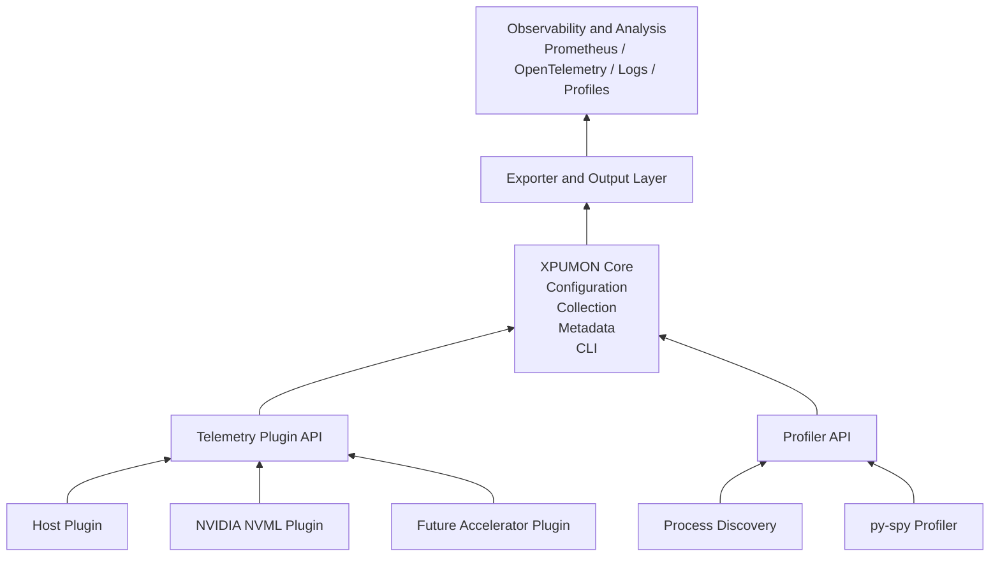
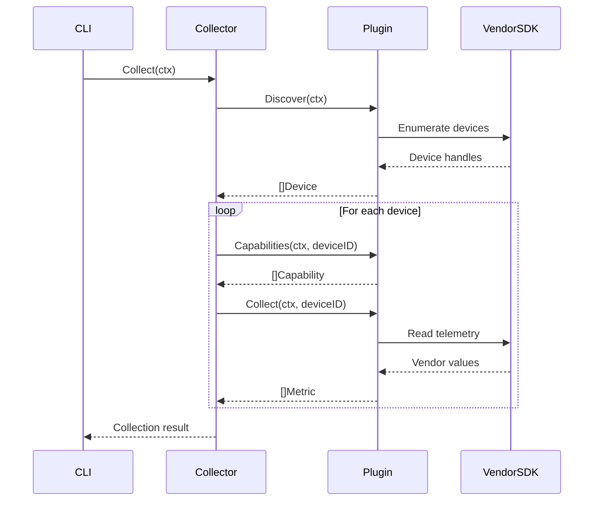
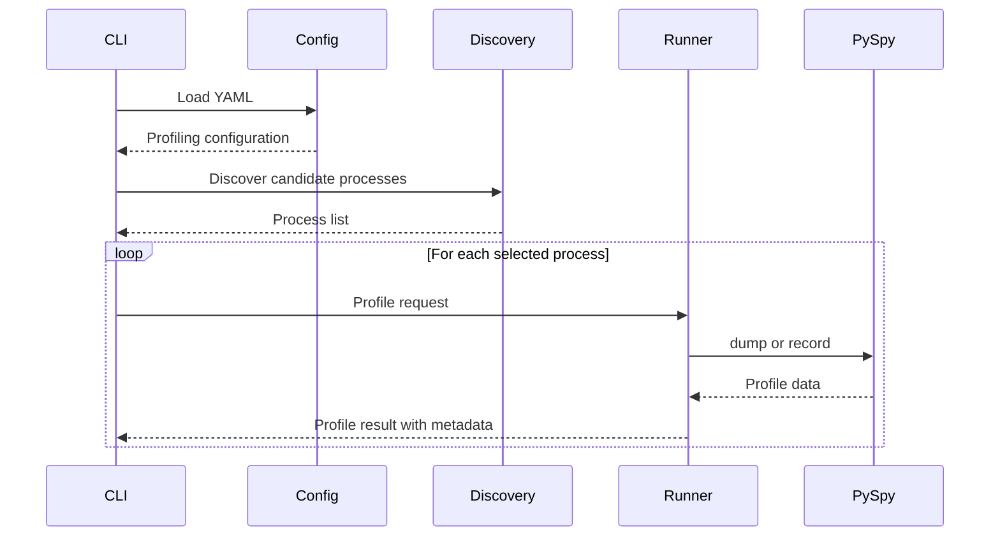

# XPUMON Overview

## Introduction

XPUMON is a vendor-neutral monitoring and profiling framework for heterogeneous AI infrastructure.

Modern AI systems may contain host CPUs and multiple types of accelerators, including:

- NVIDIA GPUs
- AMD GPUs
- Intel XPUs
- NPUs
- DPUs
- FPGAs
- Vendor-specific AI ASICs

Each device family exposes different management libraries, metric names, data types, and feature sets.

XPUMON provides a common plugin interface and shared telemetry model so that these hardware-specific differences remain isolated from the core monitoring framework.

XPUMON also provides workload-level profiling through integrations such as `py-spy`. This makes it possible to inspect not only whether an accelerator is active, but also which process and Python stack may be associated with the observed workload.

---

## Problem Statement

Accelerator monitoring is typically implemented using vendor-specific software.

Examples include:

- NVIDIA NVML and DCGM
- AMD SMI
- Intel Level Zero
- Vendor-specific device management APIs
- Vendor-specific metric exporters

These systems are effective for their respective hardware, but heterogeneous environments create several problems:

1. Every vendor exposes a different API.
2. Equivalent metrics may use different names and units.
3. Device capabilities differ between vendors and models.
4. Every exporter requires separate deployment and maintenance.
5. Workload metadata is often disconnected from hardware telemetry.
6. Accelerator utilization alone does not explain which application code caused the activity.

XPUMON addresses these problems by defining:

- A vendor-neutral plugin contract
- Shared device and metric data models
- Capability-based metric discovery
- A common collection workflow
- Optional workload profiling
- A future unified export layer

---

## Vision

XPUMON aims to become a common observability layer for heterogeneous AI infrastructure.

The framework should allow operators and developers to answer questions such as:

- Which accelerator devices are available?
- Which metrics does each device support?
- How much memory, power, and compute capacity is being used?
- Which process is using an accelerator?
- Which container or job owns that process?
- Which Python code path is currently active?
- Can the same observability pipeline support multiple accelerator vendors?

The long-term objective is to expose hardware, process, and workload telemetry through a consistent model without replacing the underlying vendor SDKs.

---

## Goals

### Primary Goals

- Support heterogeneous host and accelerator telemetry sources
- Provide a vendor-neutral monitoring interface
- Isolate vendor SDK dependencies inside plugins
- Normalize commonly supported telemetry
- Discover devices dynamically
- Represent device capabilities explicitly
- Support multiple devices per plugin
- Associate telemetry with process and workload metadata
- Integrate with Prometheus and OpenTelemetry
- Remain extensible for future accelerator architectures

### Profiling Goals

- Discover relevant workload processes
- Capture Python stack snapshots
- Support duration-based sampling profiles
- Preserve process and workload metadata with profile output
- Allow hardware telemetry and application profiling to be correlated
- Avoid embedding Python-runtime-specific logic into the core metric interface

### Long-Term Goals

- Kubernetes-native deployment
- Automatic container and pod attribution
- Health diagnostics and event monitoring
- Continuous profiling
- GPU-process correlation
- Unified accelerator topology representation
- Multi-vendor metric normalization
- Additional accelerator plugins
- Stable exporter and configuration APIs

---

## Non-Goals

XPUMON is not intended to:

- Replace NVIDIA NVML, DCGM, AMD SMI, or another vendor SDK
- Control accelerator clocks or power limits
- Update device firmware
- Replace vendor diagnostic tools
- Replace kernel-level or GPU-kernel profilers
- Reimplement `py-spy`
- Provide application performance optimization automatically
- Guarantee that every vendor exposes equivalent metrics

Hardware control and vendor-specific management remain the responsibility of the corresponding vendor software stack.

XPUMON consumes information from those stacks and translates it into common framework models where practical.

---

## Design Principles

### Vendor Neutrality

The core framework must not directly depend on a particular accelerator vendor.

Vendor-specific imports, initialization, device handles, and error codes should remain inside the corresponding plugin package.

For example:

```text
plugins/nvidia
    └── imports NVIDIA NVML

pkg/collector
    └── imports only the shared plugin package
```

The collector should operate on the `plugin.Plugin` interface rather than an NVML-specific implementation.

---

### Capability-Based Design

Not every device supports the same telemetry.

A capability describes what a device can expose rather than assuming all devices provide an identical metric set.

Typical capabilities include:

- Temperature
- Power
- Energy
- Memory
- Utilization
- Health
- Fabric
- ECC
- PCIe
- Process accounting
- Topology

The collector can inspect capabilities before requesting or interpreting device telemetry.

---

### Plugin Extensibility

Each supported telemetry source is implemented as a plugin.

Current or planned examples include:

- Mock plugin
- Host plugin
- NVIDIA NVML plugin
- AMD plugin
- Intel plugin
- Future ASIC plugin

A new vendor can generally be supported by implementing the shared interface without adding vendor-specific dependencies to the core collector.

Changes to shared models may still be required when a genuinely new cross-vendor capability is introduced.

---

### Standardized Metrics

Metrics should use consistent:

- Names
- Units
- Timestamp semantics
- Device identifiers
- Value types
- Metadata conventions

For example, device memory should not be represented as bytes by one plugin and megabytes by another under the same common metric name.

Vendor-specific information may be retained through:

- Vendor-prefixed metric names
- Optional attributes
- Plugin-specific extensions

Common normalization should not discard important hardware semantics.

---

### Separation of Metrics and Profiles

Metric collection and profiling have different data characteristics.

Metrics are generally:

- Structured
- Numeric
- Periodic
- Suitable for time-series storage

Profiles are generally:

- Stack-oriented
- Potentially large
- Process-specific
- Collected as snapshots or sampling sessions

XPUMON therefore keeps the device plugin interface separate from the profiler interface while allowing both outputs to share metadata such as:

- Hostname
- PID
- Device ID
- Container ID
- Job ID
- Command
- Start and end timestamps

---

### Explicit Mode Validation

Configuration validation should depend on the selected profiler mode.

For example:

- `dump` requires a PID and optional native-stack setting
- `record` additionally requires duration, sampling rate, and output format

Fields that are meaningless for one mode should not be required merely because another mode uses them.

---

### Graceful Degradation

A missing or unsupported metric should not necessarily cause all device collection to fail.

Plugins should distinguish between:

- Context cancellation
- Device initialization failure
- Unsupported telemetry
- Temporary metric retrieval failure
- Fatal plugin failure

Where practical, supported metrics should still be returned when an unrelated metric is unavailable.

---

### Cloud-Native Integration

XPUMON is designed to integrate with modern observability systems, including:

- Prometheus
- OpenTelemetry
- Grafana
- Kubernetes
- Log collection systems
- Continuous profiling backends

Exporter implementations should consume shared XPUMON results rather than importing vendor SDKs directly.

---

## High-Level Architecture



---

## Telemetry Collection Flow



A single plugin may return zero, one, or multiple devices.

The collector must not assume that one plugin corresponds to one physical device.

---

## Profiling Flow



---

## Shared Data Model

### Device

A device identifies a telemetry source.

Typical fields:

```text
Device
├── ID
├── Vendor
├── Model
└── Type
```

Examples:

- Host system
- NVIDIA GPU 0
- NVIDIA GPU 1
- Future accelerator device

Device IDs must be stable enough to correlate metrics within the lifetime and scope of a collection process.

---

### Capability

A capability describes a class of telemetry supported by a device.

```text
Capability
└── Name
```

Examples:

- `temperature`
- `power`
- `memory`
- `utilization`
- `ecc`

Capabilities describe available functionality, not an individual measurement.

---

### Metric

A metric represents a timestamped measurement.

```text
Metric
├── DeviceID
├── Name
├── Value
├── Unit
└── Timestamp
```

Example:

```text
DeviceID:  GPU-1234
Name:      memory_used
Value:     4294967296
Unit:      byte
Timestamp: 2026-07-15T09:00:00Z
```

---

### Profile

A profile represents stack data captured from a process.

Conceptually:

```text
Profile
├── Profiler
├── PID
├── Format
├── StartedAt
├── EndedAt
├── Hostname
├── DeviceID
├── ContainerID
├── JobID
├── Command
└── Data
```

Metadata availability depends on the caller and discovery implementation.

---

## Current Implementations

### Mock Plugin

The mock plugin is used to test core behavior without requiring physical accelerator hardware.

Typical uses:

- Collector testing
- Interface validation
- Deterministic metric testing
- Error-path testing

### Host Plugin

The host plugin exposes system-level telemetry separately from accelerator telemetry.

Typical host metrics include:

- CPU-related telemetry
- System memory telemetry
- Host identity

The host plugin is part of the same plugin architecture but represents the machine rather than an accelerator device.

### NVIDIA Plugin

The NVIDIA plugin uses NVML to:

- Initialize the NVIDIA management library
- Enumerate visible GPUs
- Read device information
- Advertise supported capabilities
- Collect available telemetry
- Translate NVML return codes into Go errors or unsupported-metric handling

### py-spy Profiler

The py-spy integration supports:

- `dump` mode for instantaneous stack snapshots
- `record` mode for duration-based sampling
- Native stack inclusion where supported
- Structured metadata around raw profile output

---

## Project Status

XPUMON is currently in the implementation and hardware-validation phase.

Implemented:

- Vendor-neutral plugin interface
- Shared device, capability, and metric models
- Mock plugin
- Host plugin
- NVIDIA NVML plugin
- Multi-device discovery
- Hardware metric collection
- Python process discovery
- py-spy dump mode
- py-spy record mode
- YAML-based profiler configuration
- CLI profile output

In progress:

- Stable metric normalization
- Prometheus exporter
- OpenTelemetry exporter
- Kubernetes workload attribution
- Process-to-GPU correlation
- Continuous profiling
- Additional accelerator vendors
- Stable CLI and configuration compatibility

---

## Architectural References

XPUMON takes general architectural inspiration from established hardware-management and observability systems, including:

- NVIDIA NVML
- NVIDIA DCGM
- AMD SMI
- Prometheus
- OpenTelemetry

XPUMON remains an independent project and does not attempt to duplicate every feature of these systems.
