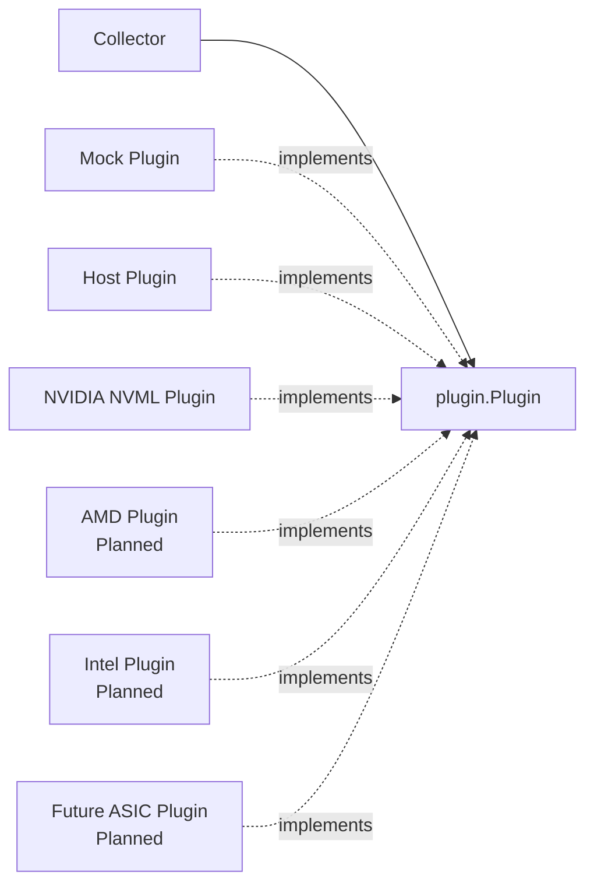
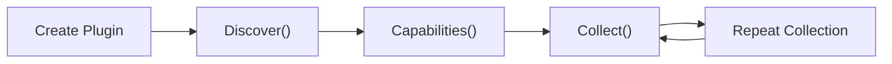
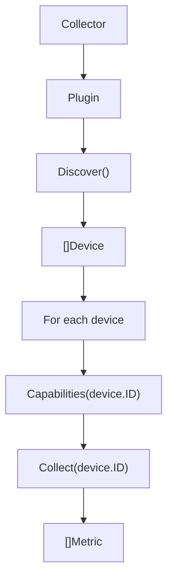

# Plugin API

XPUMON uses a vendor-neutral plugin architecture.

Each telemetry source implements the same `Plugin` interface while vendor-specific dependencies remain isolated inside the plugin package.

---

## Architecture



Implemented and planned plugins use the same core interface.

A plugin may represent:

* A host system
* A hardware accelerator vendor
* A simulated device source
* Another telemetry provider compatible with the shared models

---

## Package Boundary

The shared plugin package defines:

* The `Plugin` interface
* `Device`
* `Capability`
* `Metric`

Vendor packages implement these definitions.

```text
pkg/plugin
├── plugin.go
├── device.go
├── capability.go
└── metric.go

plugins/
├── host/
└── nvidia/
```

The collector imports the shared plugin package.

The collector should not import:

* NVIDIA NVML
* AMD SMI
* Intel Level Zero
* Another vendor-specific device SDK

---

## Plugin Interface

```go
type Plugin interface {
    Name() string
    Discover(ctx context.Context) ([]Device, error)
    Capabilities(ctx context.Context, deviceID string) ([]Capability, error)
    Collect(ctx context.Context, deviceID string) ([]Metric, error)
}
```

| Method           | Purpose                                                |
| ---------------- | ------------------------------------------------------ |
| `Name()`         | Returns a stable human-readable plugin name            |
| `Discover()`     | Discovers every device managed by the plugin           |
| `Capabilities()` | Returns telemetry capabilities supported by one device |
| `Collect()`      | Collects current telemetry from one device             |

---

## Method Contract

### `Name`

```go
Name() string
```

`Name` identifies the plugin implementation.

Examples:

```text
mock
host
nvidia
```

The name should:

* Be stable between executions
* Be concise
* Not depend on a discovered device
* Distinguish the plugin implementation from other plugins

The plugin name is not the same as a device ID.

One plugin may manage multiple devices.

---

### `Discover`

```go
Discover(ctx context.Context) ([]Device, error)
```

`Discover` enumerates all devices managed by the plugin.

Examples:

* The host plugin may return one host device.
* The NVIDIA plugin may return every GPU visible through NVML.
* A mock plugin may return a configured set of test devices.

The collector must iterate over every returned device.

```go
devices, err := p.Discover(ctx)
if err != nil {
    return err
}

for _, device := range devices {
    metrics, err := p.Collect(ctx, device.ID)
    if err != nil {
        return err
    }

    _ = metrics
}
```

#### Context Handling

Implementations should check the context before performing expensive or blocking operations.

```go
if err := ctx.Err(); err != nil {
    return nil, err
}
```

The implementation should return the context error when collection is cancelled or its deadline is exceeded.

#### Empty Discovery

Returning an empty slice without an error is valid when no managed device is present.

```go
return []plugin.Device{}, nil
```

This is different from a plugin initialization or SDK failure.

---

### `Capabilities`

```go
Capabilities(
    ctx context.Context,
    deviceID string,
) ([]Capability, error)
```

`Capabilities` reports which classes of telemetry are available for a specific device.

Not every device supports the same measurements.

Example capability matrix:

| Device      | Example capabilities                         |
| ----------- | -------------------------------------------- |
| Host        | CPU, memory                                  |
| NVIDIA GPU  | temperature, power, memory, utilization, ECC |
| AMD GPU     | temperature, power, memory, utilization      |
| FPGA        | temperature, power                           |
| Future ASIC | Implementation-specific                      |

A capability should represent a telemetry category rather than an individual sample.

Example:

```go
[]plugin.Capability{
    {Name: "temperature"},
    {Name: "power"},
    {Name: "memory"},
    {Name: "utilization"},
}
```

#### Device Validation

The plugin should return an error when `deviceID` does not refer to a device managed by that plugin.

The exact error type may evolve, but the error should clearly distinguish an invalid device from an unsupported metric.

---

### `Collect`

```go
Collect(
    ctx context.Context,
    deviceID string,
) ([]Metric, error)
```

`Collect` reads current telemetry for one device.

Every returned metric must contain the requested device ID.

```go
plugin.Metric{
    DeviceID:  deviceID,
    Name:      "memory_used",
    Value:     memoryUsed,
    Unit:      "byte",
    Timestamp: timestamp,
}
```

#### Timestamp Semantics

Metrics collected in one collection operation should normally use one shared timestamp.

```go
timestamp := time.Now().UTC()
```

Using a shared timestamp makes the returned metric batch easier to correlate.

A plugin may use more precise source timestamps when the vendor SDK exposes meaningful device-side timestamps.

#### Partial Collection

An unsupported metric should not necessarily fail the entire device collection.

For example, a device may support memory utilization but not expose a temperature sensor.

The plugin may skip unsupported metrics while returning the supported measurements.

Fatal failures include cases such as:

* Invalid device ID
* Vendor SDK initialization failure
* Lost device handle
* Context cancellation
* Corrupted or unusable SDK state

The distinction between unsupported and fatal conditions should be explicit in plugin code.

---

## Plugin Lifecycle



A typical lifecycle is:

1. Construct or register the plugin.
2. Discover managed devices.
3. Inspect each device's capabilities.
4. Collect metrics from each device.
5. Repeat collection at the configured interval.
6. Rediscover when required by the runtime.

The current interface does not prescribe initialization and shutdown methods.

A plugin that wraps an SDK requiring initialization should manage that lifecycle internally or through its constructor.

---

## Collection Workflow



A simplified collector implementation:

```go
func collectPlugin(
    ctx context.Context,
    p plugin.Plugin,
) ([]plugin.Metric, error) {
    devices, err := p.Discover(ctx)
    if err != nil {
        return nil, fmt.Errorf(
            "discover devices with plugin %q: %w",
            p.Name(),
            err,
        )
    }

    var result []plugin.Metric

    for _, device := range devices {
        if err := ctx.Err(); err != nil {
            return nil, err
        }

        metrics, err := p.Collect(ctx, device.ID)
        if err != nil {
            return nil, fmt.Errorf(
                "collect device %q with plugin %q: %w",
                device.ID,
                p.Name(),
                err,
            )
        }

        result = append(result, metrics...)
    }

    return result, nil
}
```

The final implementation may choose to:

* Continue when one device fails
* Collect devices concurrently
* Record per-device errors
* Cache capabilities
* Periodically rediscover devices

Those policies belong in the collector rather than the shared plugin interface.

---

## Shared Data Models

### Device

```go
type Device struct {
    ID     string
    Vendor string
    Model  string
    Type   string
}
```

Conceptually:

```text
Device
├── ID
├── Vendor
├── Model
└── Type
```

#### `ID`

`ID` uniquely identifies a device within the plugin's operating scope.

Preferred identifiers include stable vendor-provided UUIDs.

An index may be used when a stable identifier is unavailable, but callers should not assume an index remains stable after hardware or driver changes.

#### `Vendor`

Examples:

```text
host
nvidia
amd
intel
```

Vendor values should be normalized when possible.

#### `Model`

Examples:

```text
NVIDIA H100 80GB HBM3
NVIDIA GB10
Host System
```

The model is descriptive and should not be used as a unique identifier.

#### `Type`

Examples:

```text
host
gpu
xpu
npu
dpu
fpga
asic
```

The host plugin must return a host-oriented type rather than an accelerator type.

---

### Capability

```go
type Capability struct {
    Name string
}
```

Conceptually:

```text
Capability
└── Name
```

Capability names should:

* Be lowercase
* Be vendor-neutral where practical
* Represent a category of telemetry
* Remain stable after introduction

Examples:

```text
temperature
power
memory
utilization
ecc
fabric
process
```

---

### Metric

The exact value type should follow the implementation in `pkg/plugin`.

Conceptually:

```go
type Metric struct {
    DeviceID  string
    Name      string
    Value     any
    Unit      string
    Timestamp time.Time
}
```

Conceptually:

```text
Metric
├── DeviceID
├── Name
├── Value
├── Unit
└── Timestamp
```

#### Metric Naming

Common metric names should be:

* Lowercase
* Snake case
* Stable
* Independent of vendor branding where equivalent semantics exist

Examples:

```text
temperature
power_usage
memory_total
memory_used
memory_free
gpu_utilization
memory_utilization
```

Vendor-specific metrics may use an explicit namespace or prefix.

#### Units

Use explicit singular unit names.

Recommended examples:

```text
byte
celsius
watt
percent
joule
count
```

A metric name and unit combination must have consistent semantics across plugins.

For example, `memory_used` with unit `byte` must always represent bytes.

---

## Host Plugin Considerations

The host plugin follows the same interface as accelerator plugins.

It should return a host device similar to:

```go
plugin.Device{
    ID:     "host",
    Vendor: "host",
    Model:  "Host System",
    Type:   "host",
}
```

The exact ID may include a hostname or machine identifier if required by the implementation.

Host metrics must use the host device ID.

The host plugin should not return:

```go
Type: "xpu"
```

unless it is actually representing an XPU device.

---

## NVIDIA Plugin Considerations

The NVIDIA plugin should isolate all NVML-specific logic inside `plugins/nvidia`.

Responsibilities include:

* NVML initialization
* Device enumeration
* Device handle lookup
* Device UUID and model retrieval
* Capability declaration
* Metric collection
* NVML return-code handling

The shared collector should not receive raw NVML handles or NVML return codes.

Example device discovery pseudocode:

```go
count, ret := nvml.DeviceGetCount()
if ret != nvml.SUCCESS {
    return nil, fmt.Errorf(
        "get NVIDIA device count: %s",
        nvml.ErrorString(ret),
    )
}

devices := make([]plugin.Device, 0, count)

for index := 0; index < count; index++ {
    device, ret := nvml.DeviceGetHandleByIndex(index)
    if ret != nvml.SUCCESS {
        return nil, fmt.Errorf(
            "get NVIDIA device %d: %s",
            index,
            nvml.ErrorString(ret),
        )
    }

    uuid, ret := device.GetUUID()
    if ret != nvml.SUCCESS {
        return nil, fmt.Errorf(
            "get UUID for NVIDIA device %d: %s",
            index,
            nvml.ErrorString(ret),
        )
    }

    name, ret := device.GetName()
    if ret != nvml.SUCCESS {
        return nil, fmt.Errorf(
            "get name for NVIDIA device %d: %s",
            index,
            nvml.ErrorString(ret),
        )
    }

    devices = append(
        devices,
        plugin.Device{
            ID:     uuid,
            Vendor: "nvidia",
            Model:  name,
            Type:   "gpu",
        },
    )
}
```

A real implementation should use the exact API signatures exposed by the selected `go-nvml` version.

---

## Error Handling

Errors should include operation context.

Prefer:

```go
return nil, fmt.Errorf(
    "collect memory for device %q: %w",
    deviceID,
    err,
)
```

Avoid errors that contain only:

```text
failed
invalid
NVML error
```

Vendor errors should be translated or wrapped so callers can understand:

* Which plugin failed
* Which device failed
* Which operation failed
* Whether the error is retryable or unsupported

Do not treat context cancellation as a vendor error.

```go
if err := ctx.Err(); err != nil {
    return nil, err
}
```

---

## Concurrency

Plugin implementations should not assume that `Collect` is always called serially.

When a plugin keeps mutable state, it must document or enforce its concurrency guarantees.

Potential approaches include:

* Stateless collection
* Per-device locks
* A plugin-wide mutex
* Immutable device-handle mappings
* Collector-controlled serialization

Vendor SDK thread-safety requirements must be respected by the plugin implementation.

---

## Testing

Every plugin should include tests for:

* Plugin name
* Device discovery
* Multiple-device discovery
* Device type
* Capability reporting
* Metric device IDs
* Metric names
* Metric units
* Timestamp population
* Invalid device IDs
* Context cancellation
* Unsupported telemetry
* Vendor API failures where mockable

Run the complete test suite with:

```bash
go test ./...
```

Run one package with:

```bash
go test ./plugins/host/...
```

Do not normally run a single Go test file directly:

```bash
go test ./plugins/host/memory_linux_test.go
```

Testing only the file omits the other non-test source files from the package and can result in undefined-symbol build errors.

Use the package path instead.

---

## Adding a New Plugin

### 1. Create the Package

```text
plugins/example/
├── plugin.go
├── collect.go
└── plugin_test.go
```

Additional files may be separated by capability:

```text
plugins/example/
├── plugin.go
├── discovery.go
├── memory.go
├── power.go
├── utilization.go
└── plugin_test.go
```

### 2. Implement the Interface

```go
package example

import (
    "context"

    "github.com/hdimmfh/xpu-monitor-agent/pkg/plugin"
)

type Plugin struct{}

var _ plugin.Plugin = (*Plugin)(nil)

func (p *Plugin) Name() string {
    return "example"
}

func (p *Plugin) Discover(
    ctx context.Context,
) ([]plugin.Device, error) {
    if err := ctx.Err(); err != nil {
        return nil, err
    }

    return []plugin.Device{}, nil
}

func (p *Plugin) Capabilities(
    ctx context.Context,
    deviceID string,
) ([]plugin.Capability, error) {
    if err := ctx.Err(); err != nil {
        return nil, err
    }

    return []plugin.Capability{}, nil
}

func (p *Plugin) Collect(
    ctx context.Context,
    deviceID string,
) ([]plugin.Metric, error) {
    if err := ctx.Err(); err != nil {
        return nil, err
    }

    return []plugin.Metric{}, nil
}
```

The compile-time assertion:

```go
var _ plugin.Plugin = (*Plugin)(nil)
```

ensures that interface changes or missing methods are detected during compilation.

### 3. Keep Vendor Dependencies Local

Add the vendor SDK only to the plugin package.

Do not expose vendor-specific types through:

* `plugin.Device`
* `plugin.Capability`
* `plugin.Metric`
* Collector APIs

### 4. Register the Plugin

Register the implementation in the CLI or plugin registry used by the application.

### 5. Add Tests

Use a mockable wrapper when direct hardware access is not suitable for unit tests.

Hardware validation tests should be clearly separated from deterministic unit tests.

---

## Design Rules

Plugin implementations should follow these rules:

1. Keep the core framework vendor-neutral.
2. Depend on the shared plugin models.
3. Isolate vendor SDKs inside plugin packages.
4. Return every discovered device.
5. Do not assume one plugin manages only one device.
6. Use stable device IDs where available.
7. Use consistent common metric names and units.
8. Check context cancellation.
9. Distinguish unsupported telemetry from fatal failures.
10. Attach the requested device ID to every returned metric.
11. Avoid exposing vendor handles to the collector.
12. Add package-level tests for every implementation.
