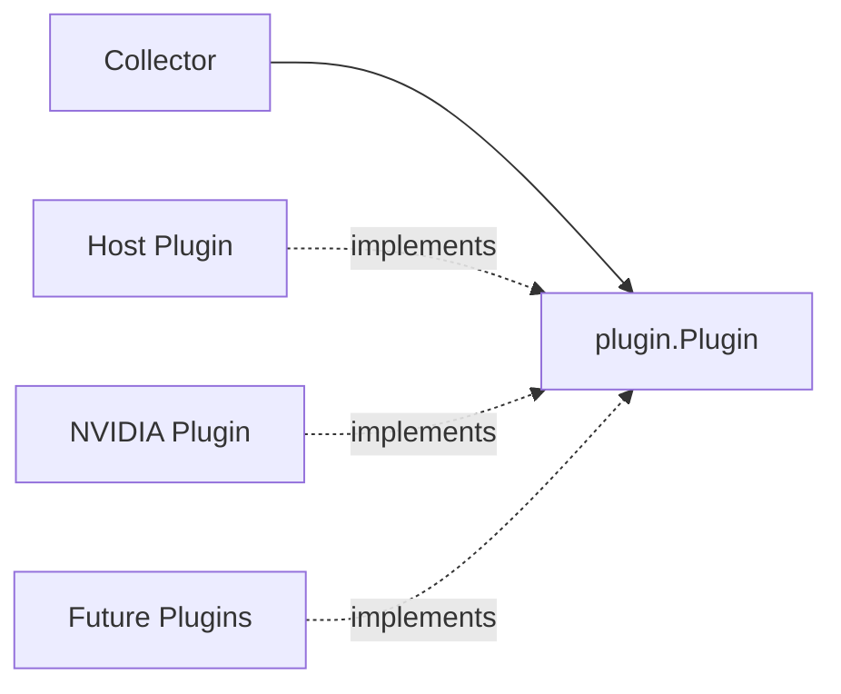
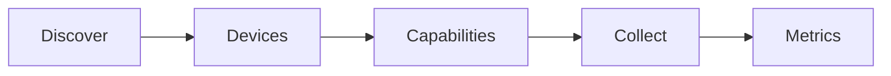

# Plugin API

## Overview

XPUMON uses a vendor-neutral plugin architecture.

Each telemetry source is implemented as a plugin while vendor-specific dependencies remain isolated from the core framework.

Current plugins include:

- Host
- NVIDIA (NVML)

The same interface can be implemented for future accelerator vendors such as AMD or Intel.

---

## Architecture



---

## Plugin Interface

Every plugin implements the following interface.

```go
type Plugin interface {
    Name() string
    Discover(ctx context.Context) ([]Device, error)
    Capabilities(ctx context.Context, deviceID string) ([]Capability, error)
    Collect(ctx context.Context, deviceID string) ([]Metric, error)
}
```

| Method | Description |
|----------|-------------|
| `Name()` | Returns the plugin name |
| `Discover()` | Discovers supported devices |
| `Capabilities()` | Returns capabilities of a device |
| `Collect()` | Collects metrics for a device |

---

## Collection Flow



The collector performs the following steps:

1. Discover devices.
2. Query supported capabilities.
3. Collect metrics for each device.

A plugin may return zero, one, or multiple devices.

---

## Shared Data Models

### Device

Represents a host or accelerator.

Typical fields include:

```text
Device
├── ID
├── Vendor
├── Model
└── Type
```

---

### Capability

Represents a telemetry category supported by a device.

Examples:

- memory
- utilization
- temperature
- power
- ecc

---

### Metric

Represents a timestamped measurement.

```text
Metric
├── DeviceID
├── Name
├── Value
├── Unit
└── Timestamp
```

Example:

```go
plugin.Metric{
    DeviceID: deviceID,
    Name: "memory_used",
    Value: memoryUsed,
    Unit: "byte",
    Timestamp: timestamp,
}
```

---

## Plugin Guidelines

Plugins should:

- Keep vendor SDKs inside the plugin package.
- Return all discovered devices.
- Support multiple devices.
- Use stable device identifiers whenever possible.
- Use common metric names and units.
- Respect `context.Context`.
- Distinguish unsupported telemetry from fatal errors.

The collector should never depend directly on vendor SDKs such as NVML.

---

## Package Layout

```text
pkg/plugin
├── plugin.go
├── device.go
├── capability.go
└── metric.go

plugins/
├── host/
└── nvidia/
```

Vendor SDKs should remain inside the corresponding plugin package.

---

## Adding a New Plugin

1. Create a new package under `plugins/`.
2. Implement the `Plugin` interface.
3. Use the shared data models.
4. Register the plugin with the collector.
5. Add unit tests.

Example:

```go
type Plugin struct{}

var _ plugin.Plugin = (*Plugin)(nil)

func (p *Plugin) Name() string {
    return "example"
}
```

---

## Design Principles

XPUMON plugins follow a few simple principles:

- Vendor-neutral interfaces
- Shared data models
- Capability-based telemetry
- Multi-device support
- Extensible architecture
- Clear separation between the collector and vendor implementations
