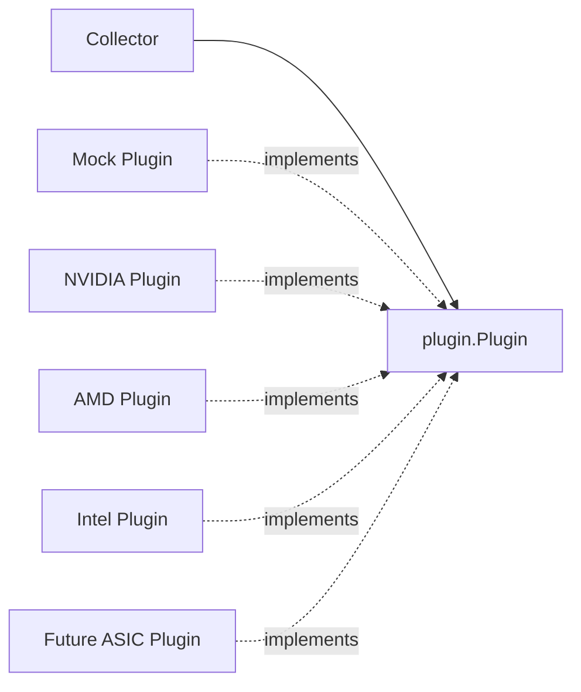
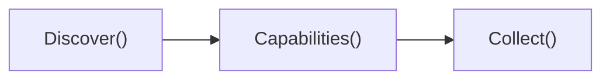
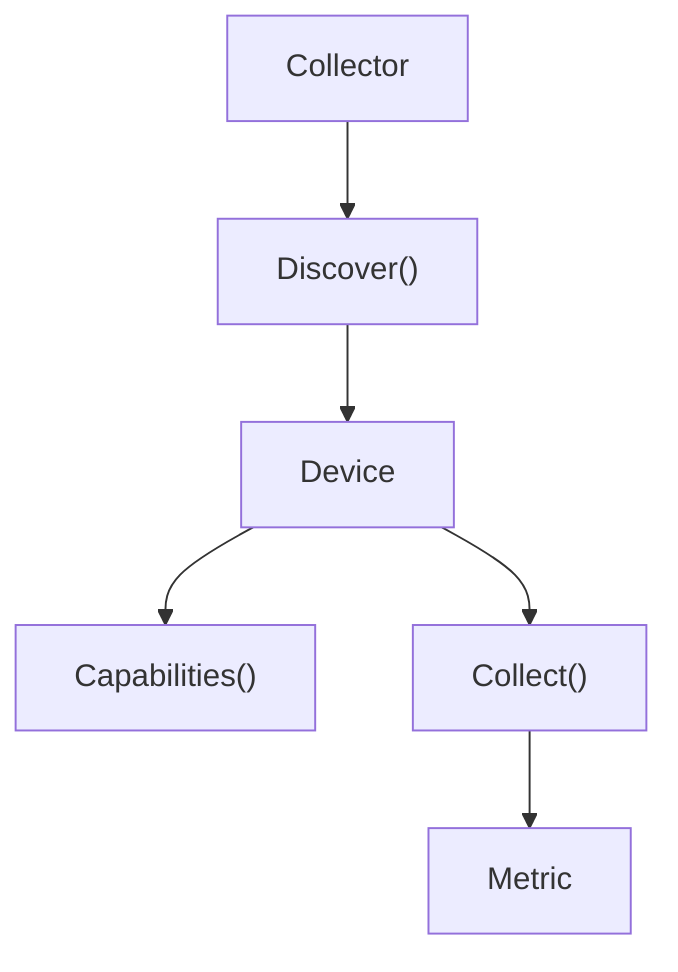

# Plugin API

XPUMON uses a vendor-neutral plugin architecture.

Each hardware vendor implements the same `Plugin` interface while the core framework remains independent of vendor-specific SDKs.

---

## Architecture



---

## Plugin Lifecycle



---

## Plugin Interface

```go
type Plugin interface {
    Name() string

    Discover(ctx context.Context) ([]Device, error)

    Capabilities(ctx context.Context, deviceID string) ([]Capability, error)

    Collect(ctx context.Context, deviceID string) ([]Metric, error)
}
```

| Method | Purpose |
|---------|---------|
| `Name()` | Returns the plugin name. |
| `Discover()` | Discovers all accelerator devices managed by the plugin. |
| `Capabilities()` | Returns the telemetry features supported by a device. |
| `Collect()` | Collects telemetry metrics from a device. |

---

## Why `Capabilities()`?

Not every accelerator supports the same telemetry.

For example:

| Device | Supported Capabilities |
|---------|------------------------|
| NVIDIA GPU | temperature, power, memory, utilization, ECC |
| AMD GPU | temperature, power, memory, utilization |
| FPGA | temperature, power |
| Future ASIC | temperature |

Before collecting metrics, the collector can determine what a device is capable of exposing.

Typical workflow:



This keeps the collector independent of vendor-specific features while allowing each plugin to expose different telemetry capabilities.

---

## Shared Data Models

```text
Device
├── ID
├── Vendor
├── Model
└── Type

Capability
└── Name

Metric
├── DeviceID
├── Name
├── Value
├── Unit
└── Timestamp
```

---

## Design Principles

- Keep the core framework vendor-neutral.
- Depend only on the `Plugin` interface.
- Isolate vendor SDKs inside plugin implementations.
- Support different telemetry capabilities for different hardware.
- Allow new vendors to be added without modifying the core framework.
