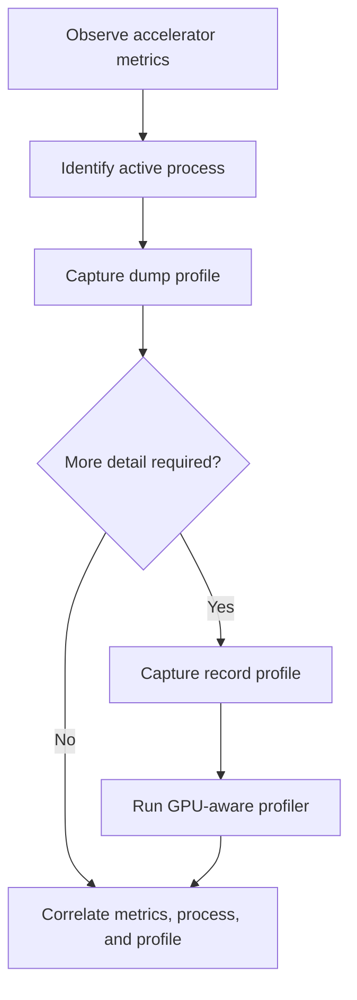

# Python Profiling

## Overview

XPUMON integrates with `py-spy` to inspect Python workloads running on monitored systems.

The profiler complements hardware telemetry.

Accelerator metrics can show:

* GPU utilization
* Memory usage
* Power consumption
* Temperature
* Active processes

Python profiling can provide additional context about:

* The currently executing Python function
* Framework calls
* Synchronization points
* Blocking operations
* Repeated application code paths

XPUMON currently supports two profiling modes:

* `dump`
* `record`

---

## Requirements

Python profiling requires:

* Linux
* A running Python workload
* `py-spy`
* Permission to inspect the target process

Verify that `py-spy` is available:

```bash
py-spy --version
```

When `py-spy` is not available through `PATH`, specify its absolute path in the configuration:

```yaml
profiling:
  enabled: true

  pyspy:
    binary: /usr/local/bin/py-spy
    mode: dump
    native: false
```

---

## Linux Permissions

`py-spy` uses operating-system process inspection mechanisms.

Profiling may fail when XPUMON does not have permission to inspect the target process.

Possible approaches include:

* Run XPUMON as the same user as the target process
* Run XPUMON with root privileges
* Grant the required container capability
* Review the Linux `ptrace_scope` configuration

For a containerized profiler, the `SYS_PTRACE` capability may be required.

Example:

```bash
docker run --cap-add SYS_PTRACE ...
```

Security policies should be reviewed before weakening ptrace restrictions or granting additional capabilities.

---

## Profiling Modes

### Dump Mode

`dump` captures an instantaneous snapshot of the current Python stacks.

Conceptually, XPUMON executes an operation equivalent to:

```bash
py-spy dump --pid <PID>
```

With native stacks enabled:

```bash
py-spy dump --pid <PID> --native
```

Dump mode does not sample the process for a configured duration.

It is suitable for:

* Point-in-time diagnosis
* Repeated stack snapshots
* CLI inspection
* Log-based process tracing
* Identifying blocking locations
* Inspecting multiple Python processes quickly

Example configuration:

```yaml
profiling:
  enabled: true

  pyspy:
    binary: py-spy
    mode: dump
    native: false
```

Run dump mode:

```bash
./xpumon profile --config ./configs/pyspy-dump.yaml
```

Repeated collection:

```bash
watch -n 1 './xpumon profile --config ./configs/pyspy-dump.yaml'
```

Each command execution creates an independent stack snapshot.

---

### Record Mode

`record` samples a process over a configured duration.

Conceptually, XPUMON executes an operation equivalent to:

```bash
py-spy record \
  --pid <PID> \
  --duration 10 \
  --rate 20 \
  --format raw
```

Example configuration:

```yaml
profiling:
  enabled: true

  pyspy:
    binary: py-spy
    mode: record
    duration: 10s
    sample_rate: 20
    format: raw
    native: false
```

Run record mode:

```bash
./xpumon profile --config ./configs/pyspy-record.yaml
```

Record mode is suitable for:

* Finding frequently sampled functions
* Comparing stack activity over an interval
* Investigating transient execution patterns
* Producing profile data for later analysis
* Estimating where a Python process spends CPU-side time

---

## Mode Comparison

| Area             | Dump                       | Record                               |
| ---------------- | -------------------------- | ------------------------------------ |
| Collection type  | Instantaneous snapshot     | Duration-based sampling              |
| Duration field   | Not used                   | Required                             |
| Sampling rate    | Not used                   | Required                             |
| Typical output   | Human-readable stack       | Sampled or aggregated profile        |
| Runtime overhead | Short-lived inspection     | Sustained during configured duration |
| Primary use      | Current execution state    | Execution frequency over time        |
| Repeated use     | External loop or scheduler | One recording session                |

---

## Process Discovery

Before profiling, XPUMON identifies candidate Python processes.

A discovered process may contain:

```text
Process
├── PID
├── Command
├── Executable
├── ContainerID
├── JobID
└── DeviceID
```

Not every field is necessarily available.

A process should only be profiled when:

* It is still running
* Its PID is valid
* It matches the configured discovery policy
* XPUMON has permission to inspect it

A process may exit between discovery and profile execution.

This race condition is normal and should be handled as a per-process error where practical.

One process failure should not necessarily prevent the remaining candidate processes from being profiled.

---

## Profile Request

A profile request conceptually contains:

```text
ProfileRequest
├── PID
├── DeviceID
├── ContainerID
├── JobID
├── Command
├── Duration
├── SampleRate
├── Format
└── Native
```

Request fields may originate from:

* YAML configuration
* CLI overrides
* Process discovery
* Accelerator process accounting
* Container metadata
* External scheduler metadata

Mode-specific fields should be validated only when they are relevant to the selected mode.

---

## Configuration Validation

### Common Validation

Both modes require:

* Profiling to be enabled
* A supported mode
* A valid `py-spy` binary value
* A valid target PID

### Dump Validation

Dump mode uses:

* PID
* Native-stack setting

The following record-specific fields should not be required:

* Duration
* Sampling rate
* Record format

### Record Validation

Record mode additionally requires:

* A positive duration
* A positive sampling rate
* A supported output format

Example validation structure:

```go
switch cfg.Profiling.PySpy.Mode {
case ModeDump:
    return nil

case ModeRecord:
    return cfg.validateRecordConfig()

default:
    return fmt.Errorf(
        "unsupported profiling.pyspy.mode %q",
        cfg.Profiling.PySpy.Mode,
    )
}
```

If common fields are already validated before the mode switch, dump mode may return immediately.

---

## Profile Output

XPUMON wraps raw profiler output with metadata.

Example:

```text
profile=py-spy pid=206450 format=text started_at=2026-07-15T09:00:08.290059667Z ended_at=2026-07-15T09:00:08.300029987Z hostname="worker-01" command="python torch_test.py"
profile_data_begin
Process 206450: python torch_test.py
Python v3.12.3

Thread 206450 (active): "MainThread"
    synchronize (torch/cuda/__init__.py:1219)
    <module> (torch_test.py:28)
profile_data_end
```

The output envelope separates profile metadata from raw profiler data.

Recommended metadata fields:

| Field          | Meaning                                  |
| -------------- | ---------------------------------------- |
| `profile`      | Profiler implementation                  |
| `pid`          | Target process ID                        |
| `format`       | Profile output format                    |
| `started_at`   | Collection start timestamp               |
| `ended_at`     | Collection end timestamp                 |
| `hostname`     | Host running the target process          |
| `device_id`    | Associated accelerator device when known |
| `container_id` | Associated container when known          |
| `job_id`       | Associated workload job when known       |
| `command`      | Target process command when known        |

Unknown optional metadata should either be omitted or represented consistently.

---

## Output Boundaries

Profile data is enclosed between:

```text
profile_data_begin
```

and:

```text
profile_data_end
```

These markers allow log processors to identify profile payloads reliably.

Example parser flow:

```text
Read metadata line
        ↓
Find profile_data_begin
        ↓
Read profile payload
        ↓
Find profile_data_end
        ↓
Emit structured profile event
```

The raw py-spy output should not be modified unnecessarily.

Preserving the original stack text makes troubleshooting and comparison with direct py-spy execution easier.

---

## Interpreting CUDA Workloads

CUDA execution is asynchronous.

A Python operation such as:

```python
c = torch.add(a, b)
```

may enqueue GPU work and return before the GPU operation has completed.

A later call such as:

```python
torch.cuda.synchronize()
```

waits for previously submitted CUDA work to complete.

A dump repeatedly showing:

```text
synchronize (torch/cuda/__init__.py)
```

means that the CPU-side Python thread was sampled while waiting at a synchronization point.

It does not mean:

* `synchronize()` is the GPU kernel
* The synchronization call performed the tensor addition
* The shown source line consumed all GPU execution time
* The preceding tensor operation was not executed

The Python stack represents the CPU-side state at the sampling moment.

GPU kernel execution should be examined with a GPU-aware profiler.

---

## py-spy and GPU Profilers

Different tools expose different parts of the workload.

| Tool                  | Primary view                                                 |
| --------------------- | ------------------------------------------------------------ |
| py-spy                | Python and CPU-side call stacks                              |
| NVIDIA Nsight Systems | CPU timeline, CUDA API calls, synchronization, GPU execution |
| NVIDIA Nsight Compute | Individual GPU kernel performance                            |
| NVML metrics          | Device-level state and utilization                           |
| XPUMON                | Unified metric collection and profile orchestration          |

py-spy is useful for identifying the Python call path associated with a wait or submission point.

It does not replace Nsight Systems or Nsight Compute for GPU kernel analysis.

---

## Native Stacks

Set:

```yaml
native: true
```

to request native stack frames where supported.

Native stacks may expose:

* CPython runtime frames
* Framework native code
* System library calls
* Native extension frames

Potential trade-offs include:

* More verbose output
* Additional symbol requirements
* Higher collection overhead
* Platform-dependent symbol quality
* More complex stack interpretation

Use:

```yaml
native: false
```

when Python-level stack visibility is sufficient.

---

## Repeated Dump Collection

Dump mode captures only one snapshot per execution.

To inspect how a process stack changes over time, invoke XPUMON repeatedly.

Example:

```bash
watch -n 1 './xpumon profile --config ./configs/pyspy-dump.yaml'
```

The command above runs approximately once per second.

Repeated dump collection can show patterns such as:

* A thread repeatedly waiting in the same function
* Alternation between computation and synchronization
* Periodic data-loading stalls
* A process remaining in an idle event loop
* Multiple Python processes active at different times

Repeated snapshots are not equivalent to statistical sampling.

For frequency-based analysis, use record mode.

---

## Record Output Formats

Record mode may support formats exposed by the installed py-spy version and the XPUMON runner.

Potential formats include:

* `raw`
* `flamegraph`
* `speedscope`

The configured format must be supported by both:

* The installed py-spy binary
* The XPUMON runner implementation

For terminal-oriented output or log processing, `raw` is generally the most direct format.

Example:

```yaml
format: raw
```

The exact supported set should be validated in configuration rather than passed through without checking.

---

## Container Considerations

Profiling processes inside containers may require:

* Visibility into the target PID namespace
* Permission to inspect the process
* The `SYS_PTRACE` capability
* Access to the py-spy executable
* Correct mapping between host and container PIDs

Running XPUMON outside the target container may expose host PIDs, while application metadata uses container-local PIDs.

A container-aware process model may contain:

```text
HostPID
ContainerPID
ContainerID
PodUID
Namespace
JobID
```

Automatic Kubernetes workload attribution is a future integration area.

---

## PID Namespace Mapping

A process may have different identifiers depending on the observer.

Example:

```text
Host PID:       206450
Container PID:  42
```

NVML commonly reports the host-visible PID.

A profiler running in another PID namespace may not be able to resolve that PID directly.

A future container-aware discovery implementation should preserve:

* Host PID
* Container PID
* Container ID
* Pod identity
* Namespace identity

PID mapping must be resolved before invoking py-spy.

---

## Process-to-GPU Attribution

py-spy does not determine which GPU a Python process uses.

GPU association must come from another source, such as:

* NVML compute-process APIs
* `CUDA_VISIBLE_DEVICES`
* Container device assignments
* Kubernetes device-plugin allocation
* Scheduler metadata
* Application-provided metadata

A future XPUMON correlation workflow may use:

```text
NVML GPU process PID
        +
Operating-system process metadata
        +
py-spy profile
        =
GPU-associated Python profile
```

The resulting profile can then contain:

```text
PID
GPU UUID
Container ID
Job ID
Python stack
```

---

## Multi-GPU Workloads

One process may use multiple GPUs.

In that case, a single Python profile may be associated with several device IDs.

Possible representations include:

```text
device_ids="GPU-UUID-0,GPU-UUID-1"
```

or a repeated association model:

```text
Profile PID 206450 -> GPU-UUID-0
Profile PID 206450 -> GPU-UUID-1
```

XPUMON should avoid assuming:

```text
one PID = one GPU
```

Likewise, multiple processes may share one GPU.

---

## MIG Considerations

When NVIDIA MIG is enabled, process association may refer to:

* A physical GPU
* A GPU instance
* A compute instance
* A MIG device UUID

Profile metadata should preserve the most specific device identifier available.

The implementation should avoid collapsing all MIG processes into only the parent physical GPU when MIG-level attribution is available.

MIG handling depends on:

* NVML process APIs
* Driver version
* Device model
* Current MIG configuration

---

## Grace Hopper and Grace Blackwell Considerations

Systems with tightly coupled CPU and GPU memory may expose accounting behavior that differs from conventional discrete GPUs.

Potential differences include:

* Shared or coherent memory behavior
* Device memory accounting semantics
* Host and GPU memory correlation
* Process memory values that differ from expected discrete-GPU models

Python stack profiling remains CPU-side and is not changed by the memory architecture.

However, the interpretation of memory telemetry associated with the profile may require platform-specific handling.

---

## Error Handling

### Process Not Found

The process may exit after discovery.

Recommended behavior:

* Record a per-process error
* Include the target PID
* Continue profiling remaining processes

Example error context:

```text
profile process 206450: process no longer exists
```

---

### Permission Denied

XPUMON may not have permission to inspect the process.

Recommended behavior:

* Include the target PID
* State that process-inspection permission was denied
* Avoid presenting the error as an invalid PID
* Provide the underlying py-spy error where appropriate

Example:

```text
profile process 206450 with py-spy: permission denied
```

---

### py-spy Not Found

The configured binary may not exist or may not be executable.

Recommended behavior:

* Include the configured binary value
* Return an actionable execution error

Example:

```text
execute py-spy binary "/usr/local/bin/py-spy": file not found
```

---

### Unsupported Mode

The configuration may contain a mode other than `dump` or `record`.

Recommended error:

```text
unsupported profiling.pyspy.mode "snapshot"
```

---

### Invalid Record Configuration

Examples include:

* Zero duration
* Negative duration
* Zero sample rate
* Negative sample rate
* Empty output format
* Unsupported output format

These validation checks should apply only to record mode.

Dump mode should not fail because record-only fields are absent.

---

### Profiler Command Failure

When py-spy exits with a non-zero status, the error should include:

* Target PID
* Selected mode
* Executable name
* Relevant stderr output

Avoid returning only:

```text
exit status 1
```

Prefer an error similar to:

```text
py-spy dump failed for PID 206450: permission denied
```

---

## Timeouts and Cancellation

Profile execution should respect `context.Context`.

For dump mode, cancellation should terminate the active py-spy process.

For record mode, cancellation should stop the sampling session before the configured duration completes.

Conceptually:

```go
cmd := exec.CommandContext(
    ctx,
    binary,
    args...,
)
```

When the context is cancelled, the profiler should return the context error when appropriate.

The caller should be able to distinguish:

* User cancellation
* Deadline exceeded
* py-spy execution failure
* Target process exit

---

## Output Size

Record output may become large when:

* Duration is long
* Sampling rate is high
* Native stacks are enabled
* Many threads are active
* Many processes are profiled

Operational limits may be required for:

* Maximum duration
* Maximum sampling rate
* Maximum profile payload size
* Maximum number of processes per run
* Maximum concurrent profiler processes

Large profile output should not be written indefinitely without retention controls.

---

## Performance Overhead

py-spy is designed for low-overhead sampling, but profiling is not free.

Overhead depends on:

* Sampling rate
* Number of threads
* Native stack collection
* Target Python version
* Workload behavior
* Number of concurrently profiled processes

Recommended practice:

1. Start with a moderate sample rate.
2. Measure application impact.
3. Increase the rate only when additional detail is required.
4. Limit concurrent record sessions.
5. Use dump mode for lightweight point-in-time inspection.

---

## Security

Process profiling can expose:

* Source file paths
* Function names
* Application structure
* Usernames embedded in paths
* Command-line arguments
* Potentially sensitive business logic

Profile output should be treated as operationally sensitive data.

Recommended controls include:

* Restrict profiler execution permissions
* Avoid exposing raw profiles publicly
* Apply log retention policies
* Remove unnecessary command arguments
* Limit container capabilities
* Audit profiler execution
* Protect profile storage and transport
* Redact sensitive metadata when required

---

## Recommended Operational Flow



A practical investigation sequence is:

1. Observe elevated accelerator utilization.
2. Identify the associated process.
3. Capture a py-spy dump.
4. Determine whether the process is computing, waiting, loading data, or synchronizing.
5. Use record mode when frequency analysis is required.
6. Use Nsight Systems or another GPU-aware profiler when kernel-level detail is required.
7. Correlate the results with XPUMON device metrics.

---

## Limitations

Current profiling limitations include:

* py-spy must be installed separately.
* Profiling depends on OS permissions.
* Python stacks do not directly expose GPU kernel execution.
* PID namespace mapping may be required in containers.
* GPU association must be supplied by another telemetry source.
* Processes may exit between discovery and profiling.
* Native stack quality varies by platform.
* Multi-GPU and MIG attribution require explicit device mapping.
* Continuous profile aggregation is not yet implemented.
* Kubernetes workload metadata integration is not yet automatic.

---

## Future Work

Planned profiling improvements may include:

* Automatic NVML process correlation
* Host and container PID mapping
* Kubernetes pod and job attribution
* Multi-GPU process metadata
* MIG-aware device association
* Continuous dump scheduling
* Continuous record profiling
* Profile aggregation
* Structured profile exporters
* OpenTelemetry profile integration
* Profile storage backends
* Configurable process filters
* Per-process concurrency limits
* Automatic profile-trigger conditions
