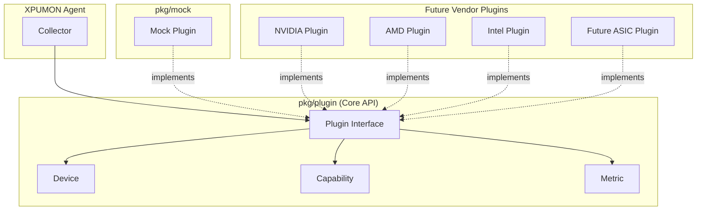
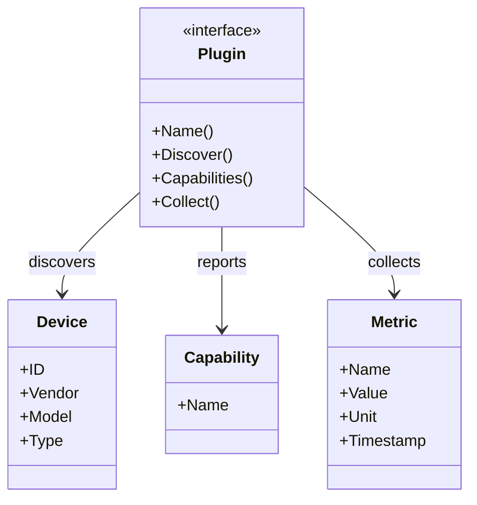

# XPUMON Core Package

`pkg` contains the vendor-neutral core components of XPUMON.

It defines the common interfaces and data models that every hardware-specific plugin must implement.

---

# Directory Structure

```text
pkg/
├── plugin/
│   ├── plugin.go       # Core plugin interface
│   ├── device.go       # Device model
│   ├── capability.go   # Capability model
│   └── metric.go       # Metric model
│
├── mock/
│   ├── mock.go         # Mock plugin implementation
│   └── mock_test.go    # Mock tests
│
└── README.md
```

---

# Architecture



---

# Core Relationship



---

# Runtime Flow

```text
Collector
    │
    ▼
Plugin.Discover()
    │
    ▼
 Device

    │
    ▼
Plugin.Capabilities(deviceID)
    │
    ▼
Capability

    │
    ▼
Plugin.Collect(deviceID)
    │
    ▼
 Metric
```

---

# Responsibilities

## pkg/plugin

Defines the vendor-neutral API.

- Plugin interface
- Device model
- Capability model
- Metric model

This package must never depend on vendor SDKs.

---

## pkg/mock

Reference implementation of `plugin.Plugin`.

Purpose:

- Verify interface behavior
- Provide unit tests
- Demonstrate how future plugins should be implemented

---

# Future Extension

Every vendor plugin should implement the same interface.

```text
plugin.Plugin
        ▲
        │
 ┌──────┼───────────────┐
 │      │       │       │
Mock  NVIDIA   AMD    Intel
                │
             Future ASIC
```

This keeps XPUMON vendor-neutral while allowing independent implementations for each hardware vendor.
